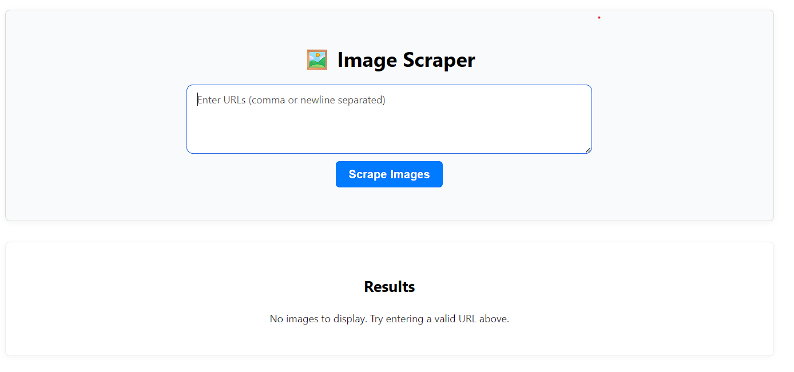
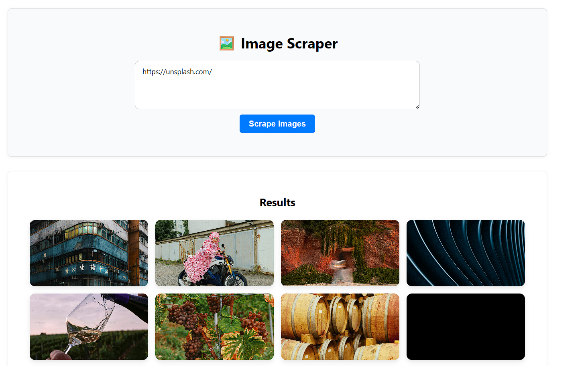
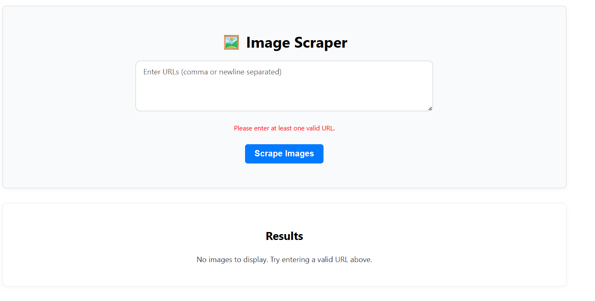

# Image Scraper Project

## Overview
This project scrapes images from user-provided URLs and displays them in a responsive grid.

## Tech Stack
- React for frontend UI
- Express.js backend API
- Axios and Cheerio for scraping
- Concurrently for running client and server simultaneously

## Setup Instructions
1. Install all dependencies:

```bash
npm install 
```
<!-- Start both frontend and backend servers together: -->
```bash
npm start
```

### Screenshots

### 1. Landing Page


### 2. Results Page (Images Scraped)


### 3. Empty Input Error


